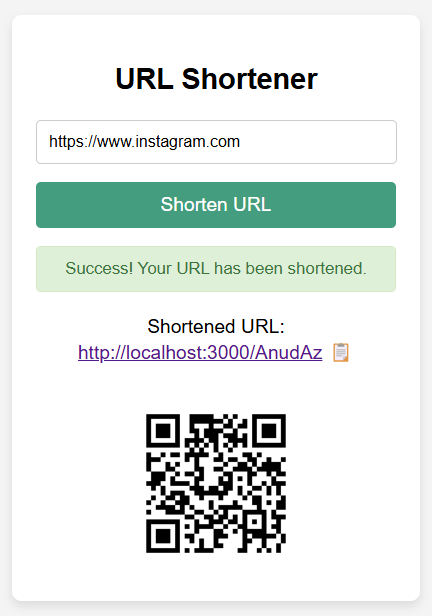
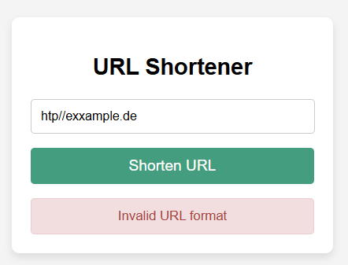
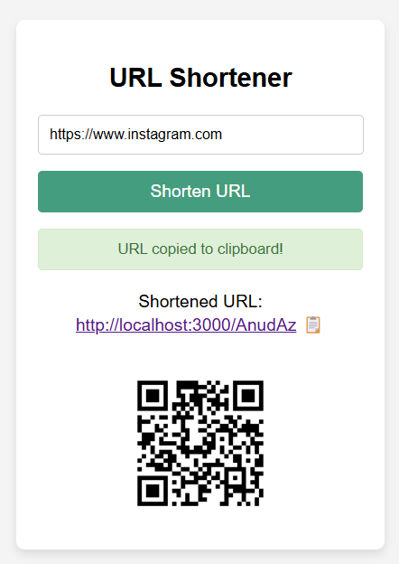

# URL Shortener Project
📝 Welcome to my URL Shortener project! 🌐

This application enables you to shorten long URLs and generate QR codes effortlessly. The main features include:

- 🔗 Shortening URLs to share easily
- 📱 Generating QR codes for quick access to your shortened links
- 📋 Copying the shortened URL to your clipboard with a single click
- ✅ URI validation to ensure only valid URLs are processed

<div style="display: flex; justify-content: space-between;">
    
    
    
</div>

👩‍💻 Whether you're a:
- 📢 Marketer looking to simplify your links
- 📊 Developer wanting to integrate URL shortening in your applications

🛠️ This tool can enhance your digital sharing capabilities and improve your workflow.

## Setup
To run the project on your local machine, clone the repository:

```bash
git clone https://github.com/DhouhaAtt/url-shortener
cd url-shortener
npm install
node index.js
